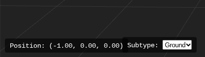

Welcome to **CHAMBERlab** — a fun and simple game where you can **play** levels and **create** your own!

---

## About

CHAMBERlab lets you jump right into playing exciting levels made by the community or unleash your creativity by building your own unique levels. Whether you want to test your platforming skills or craft intricate maps, this game has you covered.

---

## Features

- **Play Levels:** Explore a variety of user-created chambers full of puzzles and platforming fun.
- **Create Levels:** Use the built-in level editor to design your own chambers with easy-to-use tools.
- **Share & Load:** Save your creations and share them with friends or load chambers others have made.
- **Simple Controls:** Intuitive controls make playing and editing accessible to everyone.

---

  
**How To Play: Gameplay**

- Use **WASD** to move your character and use the mouse to move the camera.
- Jump with the **spacebar**.
- Hold **Shift** to slide.
- Access the **level editor** from the **main menu** to start building your own levels.

# Editor Guide

## Keyboard Controls
- Similar controls to gameplay.
- **Hold** **Shift** to be able to move camera around.
- Hold E and Q to move camera up and down.
- Ctrl + C and Ctrl + V to copy and paste created objects.

# Editor Buttons
## Top Left: Transform buttons

- On the top left of the screen, use the M (Move), R (Rotate), and S (Scale) buttons to move, scale and rotate object as you please.
## Bottom Left: Position Shower and Subtype Editor

- The position of the selected object is shown on the bottom left.
- ### IMPORTANT: Use the Subtype Changer beside the object position mentionned to change object subtypes from Ground and Wall. Not using the correct subtype (eg. using Ground subtype on something supposed to be a wall) will result in broken collision.
- There are visual indicatiors to show what subtype is on what object, Green objects have the Ground subtype, and Red object have the Wall subtype.
  ## Top Right: Add Objects, Subtype Selector, Save and Load JSON Files
  
  - Add Object brings a menu to select from Cube and Player Spawn.
  - Subtype Selector and Subtype Editor are different, the one on the top right is what will be selected on the newly added object.
  - Saving JSON files is easy, all you need to do is make a level, press the button, and it will save the .json file on your computer. This can be used on the main menu, you will be able to load it, and it will be in the level list (if it is has valid map data).
 
# Main Menu
## There are three menus. Play Levels, Level Editor, and Settings.
- Play Levels gives many complete pre-made levels made by the developer to play.

Level Editor gives buttons to create a new level, and to load a .json. 

- Loading a .json file is easy, when you have a valid .json file with valid map data, it will appear in the level list.
-  When selecting the newly added level, two options will appear: Play, and Edit.
-  - Play will load the level in gameplay.
   - Edit will open the editor with the level automatically loaded.

- Settings has settings to change.

---

## Getting Started

1. Go to https://ultragoober28.github.io/CHAMBERlab/
2. Press PLAY, and choose to play levels or use Editor.
3. Change Settings if you need to.

---

## Contributing

Want to contribute? Feel free to submit bug reports, feature requests, or pull requests. Let’s make CHAMBERlab better together!

---

## License

This project is open source under the [MIT License](LICENSE).

---

Enjoy building and playing!
